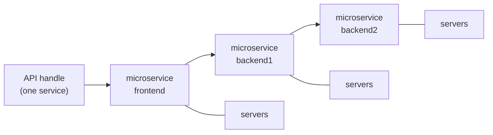

# Analysis scripts (`analyze/`)

Root-level `plot_*.py` scripts run the simulators and produce quick comparison or sweep plots. The `analyze/` directory holds scripts that depend on **extended `ms` JSON output** (per-microservice visit metrics) or other deeper behavioral analysis.

See also: [microservice-simulation.md](microservice-simulation.md) for simulator design, [lb-vs-ms.md](lb-vs-ms.md) for feature comparison.

## Vocabulary

These terms are used consistently across analyze scripts, `ms` JSON output, and documentation:

| Term | Definition | Simulator mapping |
|------|------------|-------------------|
| **Server** | A single server with its own FIFO queue and concurrency slots | Rust type `Replica`; field `server_idx`; JSON `server_utilization_pct[ms_id][server_idx]` |
| **Microservice** | A deployable callgraph component backed by one or more servers | `microservice_id` in code; callgraph `microservices` map; JSON `by_microservice`, `microservice_utilization_pct` |
| **Service** | The API-level offering; one service per entry API | Conceptual only (no Rust struct); 1:1 with an entry API in `load.json` |
| **API** | A named user-facing entry point with independent Poisson traffic | Key in `load.json`; wired via `USER → microservice:interface`; JSON `by_api` |

**Example (chain-3):** API `handle` belongs to one **service** and traverses three **microservices** (`frontend → backend1 → backend2`). Each microservice may run on multiple **servers**. Per-microservice metrics aggregate across all servers of that microservice.



### JSON field names (`ms --format json`)

| Field | Description |
|-------|-------------|
| `microservice_utilization_pct` | Per-microservice utilization (%) |
| `server_utilization_pct` | Per-server utilization nested under each microservice |
| `server_avg_queue_inflight` | Per-server time-weighted average occupancy (`queue + in_flight`, plus caller outbound LB queue under centralized/approx) |
| `by_api` | Per-API request metrics (`e2e_ms`, `processing_time_ms`, SLO fields) |
| `by_microservice` | Per-microservice visit sample arrays (see below) |
| `total_processing_p99_ms` | p99 of per-request total local processing time across the call tree |

## Prerequisites

- Python 3 with `numpy`, `matplotlib`, and `tqdm` in `.venv` (see [README](../README.md))
- Release `ms` binary: `cargo build --release --bin ms`

## Script catalog

| Script | Simulator | Description |
|--------|-----------|-------------|
| [`analyze/ms_service_distributions.py`](../analyze/ms_service_distributions.py) | `ms` | Per-microservice visit distributions, queueing/stddev panels, replica utilization, and SLO violation rates for a chain topology |

## Per-microservice visit metrics

Each user request produces one **visit** per microservice on its path (exactly one per hop in a linear chain). Metrics are recorded per visit and aggregated across all servers of that microservice.

| Metric | Definition (per visit) |
|--------|------------------------|
| **Inter-arrival** | Consecutive gaps between visit **arrival** timestamps (all servers merged, sorted) |
| **Inter-departure** | Consecutive gaps between visit **departure** timestamps |
| **Response time** | `departure − arrival` (queueing, local processing, and time blocked waiting for downstream RPCs) |
| **Queueing delay** | `(response_time − Σ downstream dependency response times) − processing_time`; includes replica server queue and caller outbound-queue wait under pull-based outbound policies |
| **Cumulative queueing delay** | Running sum of per-hop queueing delays along the request path in `microservice_order` through the current hop |
| **Processing time** | Sum of sampled local hop durations at that microservice only (excludes queueing) |
| **Slack-d** | `deadline − arrival` at visit arrival |
| **prob_latency_gt_slo** | Fraction of visits where the global API deadline was exceeded at departure (`response_time_ms > slack_d_ms`) |

### Visit lifecycle

1. **Arrival** — first `Upstream` enqueue at a microservice's server (not `DownstreamReturn` continuations).
2. **Local processing** — accumulated on each `complete()` (`hop.duration`); downstream dependency response times accumulated on each `DownstreamReturn`.
3. **Departure** — when the request returns to its caller or completes at the entry microservice; queueing delay is computed from response time, downstream totals, and local processing.

### `by_microservice` JSON schema

```json
{
  "by_microservice": {
    "frontend": {
      "inter_arrival_ms": [0.12, 0.08, ...],
      "inter_departure_ms": [0.15, 0.11, ...],
      "response_time_ms": [1.2, 0.9, ...],
      "queueing_delay_ms": [0.3, 0.1, ...],
      "processing_time_ms": [0.5, 0.4, ...],
      "slack_d_ms": [14.8, 15.1, ...],
      "prob_latency_gt_slo": 0.012
    }
  },
  "total_processing_p99_ms": 6.76
}
```

For a linear chain with `n` completed requests, each microservice has `n` visits and `n − 1` inter-arrival / inter-departure samples.

## Normalization

Analysis scripts use a **unified** scale: the p99 of per-request **total processing time** — the sum of local processing times across all microservices visited on that request (excludes queueing).

The simulator exports this as top-level `total_processing_p99_ms` (for a single-API chain, this equals the p99 of `by_api[*].processing_time_ms`).

The same divisor is applied to **processing time** and **queueing delay** at every microservice so CDFs are directly comparable. Inter-arrival and inter-departure remain in raw milliseconds.

## Running examples

```bash
cargo build --release --bin ms

.venv/bin/python analyze/ms_service_distributions.py --n 100000 --seed 42
```

Custom fixtures and policy variants:

```bash
.venv/bin/python analyze/ms_service_distributions.py \
  --callgraph tests/chain/3/callgraph.json \
  --load-file tests/chain/3/load.json \
  --n 50000 --seed 7 \
  --output output/ms_service_distributions_chain3.pdf

# approx unbound with outbound EDF queue scheduling
.venv/bin/python analyze/ms_service_distributions.py \
  --callgraph tests/chain/3/callgraph.json \
  --load-file tests/chain/3/load.json \
  --lb-policy approx --pull-policy least-request \
  --approx-sched edf \
  --comment approx-lr-nb-edf
```

## Output artifacts

`ms_service_distributions.py` writes a **4 × 2** multi-panel PDF (default: `output/ms_service_distributions_tests_chain_<N>.pdf`):

| Row | Left | Right |
|-----|------|-------|
| **0** | Cumulative queueing violin | Cumulative queueing stddev (independent vs actual) |
| **1** | Response time violin | Avg queue+in-flight occupancy per replica (scatter) |
| **2** | Slack-d CDF | Per-hop queueing stddev |
| **3** | Replica utilization | SLO violations (%) per microservice |

The slack-d CDF overlays all microservices (shared legend at top). Violin panels show p50, p90, and p99 percentile markers.

## Extending

To add a new analyze script:

1. Place it under `analyze/` and reuse helpers from `plot_cdfs.py` (`ensure_release_binary`, `run_ms_simulation`) and `plotting_primitive.py`.
2. Document required JSON fields; extend the `ms` simulator if new metrics are needed (Python cannot derive per-microservice visit timing from `by_api` alone).
3. Add a row to the script catalog table in this file and link from [README](../README.md).
