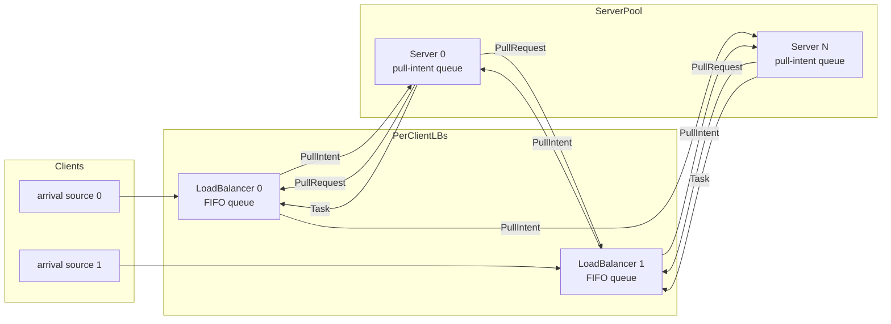
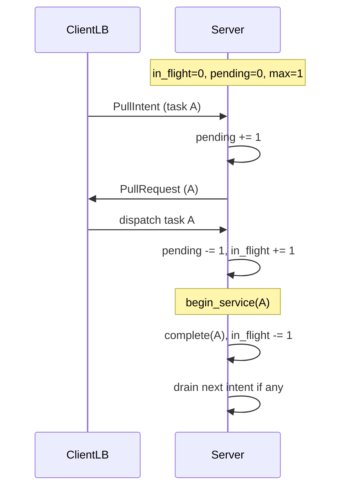

# Approx policy (decentralized pull)

This document describes the **approx** load-balancing policy: architecture, wire protocol, concurrency accounting (`in_flight`, `pending_pulls`, `pull_intent_load`, `local_inflight`), latency semantics, CLI flags, and how it differs between the `lb` and `ms` simulators.

See also:

- [lb-simulation.md](lb-simulation.md) — general `lb` simulator (push and centralized policies)
- [microservice-simulation.md](microservice-simulation.md) — general `ms` simulator
- [lb-vs-ms.md](lb-vs-ms.md) — feature comparison
- [approx-wiring-lessons.md](approx-wiring-lessons.md) — postmortem on ms approx pull port wiring (avoid repeating)

## Overview

**Approx** is a **decentralized pull** policy. Unlike push policies (tasks pushed to servers on arrival) or **centralized** (one global pull queue), approx gives each client/caller its own FIFO queue and uses a two-phase pull protocol:

1. **Pull intent** — the client balancer tells a server “I have work for you.”
2. **Pull + dispatch** — when the server has spare capacity, it pulls from that client balancer and starts service immediately. By default the pull is **bound** to the queued item identified by `request_id`; with **`--approx-sched fcfs`** or **`--approx-sched edf`** the balancer ignores the pull's `request_id` and dispatches the queue head (FCFS or earliest-deadline, respectively).

Backlog lives at **client-side queues**, not at server task queues. Servers queue **pull intents**, not tasks.

| Aspect | Push | Centralized | Approx |
|--------|------|-------------|--------|
| Queue location | Server FIFO | Single global LB FIFO | Per-client LB FIFO |
| Dispatch trigger | Arrival | Server pull (one global LB) | Pull intent → server pull |
| Server task queue | Yes | No | No |
| Load signal for routing | `local_inflight` | N/A (FCFS pull order) | `pull_intent_load` |
| `--pull-policy` | N/A | N/A | **Required** |
| Pull fulfillment | Bound by `request_id` | Bound by `request_id` | Bound (default) or queue head via `--approx-sched` |
| `--lb-subset-size` | Yes | Ignored (`lb`) | Yes |

Ingress in `ms` stays push power-of-two on `EdgeBalancer` (same as `centralized` / `cl`). Approx applies to **outbound** routing only in `ms`.

## Wire protocol

Types live in [`src/approx.rs`](../src/approx.rs):

```rust
PullIntent { sender_id, request_id }  // balancer → server
PullRequest { server_idx, request_id } // server → balancer
```

| Field | `lb` | `ms` |
|-------|------|------|
| `sender_id` | Client `lb_id` | Caller `rb_id` (replica balancer id) |
| `request_id` | Per-client `task_id` | Hop `request_id` |
| `server_idx` | Pulling server index | Pulling replica index |

## Architecture diagrams

### `lb` simulator



### `ms` simulator (outbound hop)

```
User → EdgeBalancer(handle) → frontend/0
                                │
frontend/0 ──▶ ReplicaBalancer(frontend/0) ──PullIntent──▶ backend1/*
                                ▲                              │
                                └──────── ReplicaPull ─────────┘
```

Each caller replica has a `ReplicaBalancer` per downstream target microservice. Queue topology matches `lb` approx, but queues hold `OutboundCall` items keyed by `request_id`.

## Load and concurrency counters

Approx uses **four distinct counters**. Confusing them leads to incorrect mental models (especially around end-to-end latency).

### 1. `pull_intent_load` (balancer-side, routing only)

Maintained per server index at each client `LoadBalancer` / `ReplicaBalancer`. Counts pull intents **sent but not yet fulfilled** by a successful pull + dispatch.

| Event | `pull_intent_load[server]` |
|-------|---------------------------|
| Task/call arrives; pull intent sent to `server` | `+1` |
| Server pull succeeds; task/call dispatched | `-1` |

Bound pulls always succeed under correct operation. A failed lookup is an invariant violation and terminates the run (see [Intent binding invariant](#intent-binding-invariant)).

Used exclusively by `--pull-policy` for server selection. **Not** used by push `--lb-policy`.

### 2. `local_inflight` (balancer-side, release accounting)

Same as push policies: increments when a task is **dispatched to a server**, decrements on `release` at completion. Tracks “this balancer has assigned work to that server that has not finished yet.”

Under approx, increment happens in `dispatch_to_server` after a successful pull, not on arrival.

### 3. `in_flight` (server/replica-side, active service)

Tasks/hops currently being processed (`begin_service` running). Incremented when service starts; decremented on `complete`.

Under approx, servers **never** enqueue tasks locally — `input` always calls `begin_service` immediately. Concurrency is enforced by the pull mechanism, not by a server task queue.

### 4. `pending_pulls` (server/replica-side, reserved slots)

**Outstanding pull requests** sent to a client balancer whose corresponding task/hop has **not yet arrived** back at the server.

| Event | `pending_pulls` |
|-------|-----------------|
| Server pops intent and sends `PullRequest` / `ReplicaPull` | `+1` |
| Dispatched task/hop arrives at `input` | `-1` |
| Pull output missing (misconfiguration) | `-1` (immediate rollback) |

#### Why `pending_pulls` exists

Pull handling is asynchronous: the server sends a pull, awaits message delivery, and only later receives the task on `input`. Without `pending_pulls`, a drain loop could issue **multiple pulls** while `in_flight` was still unchanged, dispatching several tasks in parallel beyond `--concurrency`. That bypassed the client LB queue, produced utilization > 100%, and made e2e latency artificially low compared to push policies.

**Capacity gate:**

```
in_flight + pending_pulls < max_concurrency
```

At most **one pull** is sent per `drain_pull_intents_async` invocation. After each completion, `drain_pull_intents_async` runs again to process the next queued pull intent.



### Counter summary

| Counter | Where | Purpose |
|---------|-------|---------|
| `pull_intent_load` | Client balancer | `--pull-policy` server selection |
| `local_inflight` | Client balancer | Release lifecycle / partial observability |
| `in_flight` | Server / replica | Active processing slots |
| `pending_pulls` | Server / replica | Reserved slots for in-transit pulls |

## Task lifecycle (`lb`)

1. **Arrival.** `task_source` delivers a task to the client LB `input`.
2. **Enqueue + intent.** LB assigns monotonic `task_id`, pushes task onto its FIFO queue, selects a server via `--pull-policy` on `pull_intent_load`, increments `pull_intent_load[server]`, sends `PullIntent { sender_id: lb_id, request_id }`.
3. **Intent queue.** Server `receive_pull_intent` pushes the intent and calls `drain_pull_intents_async`.
4. **Pull.** If capacity allows, server pops one intent, increments `pending_pulls`, sends `PullRequest` to the originating LB.
5. **Dispatch.** LB `pull` handler fulfills the pull: in **bound** mode (default, omit `--approx-sched`), removes the task whose `task_id` matches `pull.request_id`; with **`--approx-sched fcfs`**, removes the FIFO head regardless of `pull.request_id`. Then decrements `pull_intent_load`, increments `local_inflight`, sends task to `Server::input`.
6. **Service.** Server decrements `pending_pulls`, increments `in_flight`, schedules completion after `duration`.
7. **Completion.** `finish` set; task sent to stats sink; `release` decrements `local_inflight`; `in_flight` decremented; `drain_pull_intents_async` processes next intent.

Each pull intent is bound to a specific queued item via `request_id` at intent-send time. There is a 1:1 mapping between intents and queued requests. Fulfillment semantics depend on `--approx-sched` (see below).

## Intent binding invariant

Every `PullIntent` / `PullRequest` / `ReplicaPull` carries the `request_id` of exactly one queued item. Servers always send pulls with that bound id.

### Bound mode (default)

When a server pull arrives at the balancer, the bound item **must** be present in the queue. Lookup is by `request_id` (stored as `task_id` on the queued `Task`).

If lookup fails (missing `request_id`, unknown queue, or no matching id), the simulator logs details to stderr and **panics** via `fatal_pull_abort` in [`src/approx.rs`](../src/approx.rs). This should never happen in a correct run; it indicates a simulator bug or miswired ports.

### Unbound pull modes (`--approx-sched`)

Omit **`--approx-sched`** for **bound** mode (default): pull fulfillment removes the item matching `pull.request_id`.

With **`--approx-sched fcfs`**, pull fulfillment **ignores** `pull.request_id` and always pops the **head** of the outbound queue (oldest enqueued item, FCFS). With **`--approx-sched edf`** (**`ms` only**), outbound queues are ordered by hop deadline and the head is the **earliest-deadline** item.

In `lb`, `--approx-sched fcfs` uses FCFS on the client task queue (`queue.remove(0)`). In `ms`, unbound modes use the per-target outbound queue on each `ReplicaBalancer` (`outbound_queues[target].pop_front()`). Pull intents and pull messages still carry `request_id` on the wire — only the balancer's `pull` handler changes.

| Aspect | Bound (default) | `--approx-sched fcfs` | `--approx-sched edf` (`ms`) |
|--------|-----------------|------------------------|-------------------------------|
| Fulfillment | Remove item matching `pull.request_id` | Remove FIFO head | Remove earliest-deadline head |
| `request_id` on wire | Required; must match a queued item | Still sent; ignored at fulfillment | Still sent; ignored at fulfillment |
| Empty queue on pull | Panic (`bound task/call not found` or similar) | Panic (`no queued task/call for approx pull`) | Same |
| Simulator support | `lb` and `ms` | `lb` and `ms` (outbound only in `ms`) | **`ms` only** |

Use unbound modes to model decentralized pull where the server cannot rely on intent ids to identify a specific queued item — fulfillment is driven by queue discipline at the client/caller balancer regardless of which intent triggered the pull. In `ms`, queue ordering is **per `(rb_id, target_microservice)`** queue.

### Outbound queue scheduling (`--approx-sched`)

Independent of server-side [`--scheduling`](scheduling.md). Requires **`--lb-policy approx`**.

| Flag | Default | Values | Description |
|------|---------|--------|-------------|
| `--approx-sched` | *(omit)* | `fcfs`, `edf` | Omit for bound 1:1 pulls; `fcfs` or `edf` for unbound queue-head fulfillment |

- **`fcfs`**: append on enqueue (`push_back`); pulls `pop_front` (FCFS head).
- **`edf`**: insert by `hop.deadline` on enqueue (same tie-breaking as server EDF); pulls `pop_front` (earliest deadline at head). **`ms` only.**

Validation ([`src/policy.rs`](../src/policy.rs)): any `--approx-sched` value requires `--lb-policy approx`; `--approx-sched edf` is only supported by the `ms` simulator.

Trace-based tests record pull events via [`LbPullAudit`](../src/lb_pull_audit.rs) (`lb`) or [`ApproxPullAudit`](../src/approx_audit.rs) (`ms`) and check `validate_no_bind()` (FCFS) or `validate_no_bind_edf()` (EDF) invariants (queue head popped, intent id may differ from pulled id). See [`tests/lb_no_bind_audit.rs`](../tests/lb_no_bind_audit.rs), [`tests/ms_no_bind_audit.rs`](../tests/ms_no_bind_audit.rs), and [`tests/ms_no_bind_edf_audit.rs`](../tests/ms_no_bind_edf_audit.rs).

## Port wiring (`lb`)

| Port | Direction | Handler |
|------|-----------|---------|
| `LoadBalancer::input` | arrival source → LB | Enqueue task; send pull intent |
| `LoadBalancer::pull` | server → LB | Fulfill pull; dispatch task |
| `LoadBalancer::release` | server → LB | Decrement `local_inflight` |
| `LoadBalancer::outputs[j]` | LB → server | Dispatched task → `Server::input` |
| `LoadBalancer::pull_intent_outputs[j]` | LB → server | `PullIntent` → `Server::receive_pull_intent` |
| `Server::pull_outputs[lb_id]` | server → LB | `PullRequest` → `LoadBalancer::pull` |
| `Server::release_outputs[lb_id]` | server → LB | `usize` → `LoadBalancer::release` |

Unlike centralized, approx does **not** call `schedule_initial_pulls` at t=0. The first pull happens when the first pull intent arrives (or after a completion drains the intent queue). This affects early transients only.

## Port wiring (`ms`)

Same protocol at the outbound layer:

| Component | Role |
|-----------|------|
| `ReplicaBalancer` | Per-caller-replica outbound queues; pull intents; `pull` handler (bound or unbound per target) |
| `Replica` | Pull-intent queue; `pending_pulls`; `approx_pull_outputs` (map keyed by `rb_id`) back to balancers |
| `ReplicaPull` | Extended pull message including `target_microservice` |

When an approx-dispatched hop arrives at a downstream replica with `slot_release` set, the replica decrements `pending_pulls` before `begin_service` (parallel to `Server::input` under approx).

## End-to-end latency

E2e is **`finish - start`** per completed task/hop. No separate LB-queue timestamp is stored.

Queue wait at the client balancer is included implicitly in the flat `lb` simulator:

```
queueing_delay = (finish - start) - duration
               ≈ time waiting in client LB queue + any other queueing on the path
```

Per-microservice visit metrics in `ms` use the same idea at each hop: subtract downstream dependency response times and local processing from total visit response time. See [microservice-simulation.md](microservice-simulation.md#per-microservice-visit-metrics).

Under correct concurrency enforcement, approx and push policies produce **similar** e2e distributions when routing is a no-op (e.g. `--clients 1 --servers 1`), because both model the same single-server FCFS system with backlog in different locations.

The regression test `lb_all_policies_similar_with_single_server` in [`tests/lb_policy_equivalence.rs`](../tests/lb_policy_equivalence.rs) checks this under overload with constant arrivals and service times.

## CLI flags

| Flag | Required | Description |
|------|----------|-------------|
| `--lb-policy approx` | — | Enable approx |
| `--pull-policy` | **Yes** | Server selection for pull intents: `random`, `power-of-two`, `least-request`, `round-robin`. Reuses push policy implementations on the `pull_intent_load` slice. |
| `--approx-sched` | No | Omit for bound 1:1 pulls. `fcfs`: unbound FCFS head. `edf`: unbound EDF head (**`ms` only**). Requires `approx`. Independent of `--scheduling`. |
| `--lb-subset-size` | No | Supported (same as push); restricts `--pull-policy` choices |

Validation ([`src/policy.rs`](../src/policy.rs)):

- `--pull-policy` required with `approx`; forbidden with other `--lb-policy` values
- `--approx-sched` only with `approx` (`lb` and `ms` binaries)
- `--approx-sched edf` only on the `ms` binary

## Incompatibilities

| Feature | Supported with approx? | Reason |
|---------|------------------------|--------|
| `--expresslane` (`lb`) | No | Backlog at client LBs, not server queues where eviction applies |
| `--shed-delay` (`lb`) | No | Servers do not queue tasks locally |
| `cl`, `cl-lr`, `corr` (`lb`) | No | `ms`-only policies |

See [work-shedding.md](work-shedding.md) and [expresslane.md](expresslane.md).

## Comparison with centralized

| | Centralized | Approx |
|---|-------------|--------|
| LB count | 1 (`lb`) / 1 per downstream target (`ms`) | 1 per client (`lb`) / 1 per caller replica (`ms`) |
| Task queue | Global (or per-target) | Per-client/per-caller |
| Pull trigger | `request_pull` on completion + warm-start pulls | Pull intent arrival + drain on completion |
| Concurrency gate | One pull per completion; `in_flight` checked before pull | `in_flight + pending_pulls`; one pull per drain |
| Routing | FCFS pull order | `--pull-policy` on `pull_intent_load` |
| Subset routing | Ignored (`lb`) | Supported |

## Design choices

| Choice | Decision |
|--------|----------|
| LB topology | One balancer per client (`lb`) / per caller replica (`ms`) |
| Server choice | `--pull-policy` at arrival/intent time |
| Intent binding | On by default (omit `--approx-sched`); violations panic. `--approx-sched fcfs`/`edf`: fulfill queue head, ignore pull id |
| Server task queue | Disabled under approx |
| Server intent queue | FIFO per server/replica |
| Load for routing | `pull_intent_load`, not `local_inflight` |
| Release lifecycle | Standard `local_inflight` via `release` on complete |

## Source file map

| File | Responsibility |
|------|----------------|
| [`src/approx.rs`](../src/approx.rs) | `PullIntent`, `PullRequest`, `fatal_pull_abort` |
| [`src/policy.rs`](../src/policy.rs) | `PullPolicyKind`, CLI validation, `ApproxPolicy` stub |
| [`src/load_balancer.rs`](../src/load_balancer.rs) | Client queue, pull intents, pull handler (bound and unbound) |
| [`src/server.rs`](../src/server.rs) | Intent queue, `pending_pulls`, drain, approx `input` |
| [`src/lb_pull_audit.rs`](../src/lb_pull_audit.rs) | Trace recorder for approx pull events; `validate_bound()` / `validate_no_bind()` |
| [`src/microservice/balancer.rs`](../src/microservice/balancer.rs) | `ReplicaBalancer` approx outbound (bound and unbound) |
| [`src/microservice/replica.rs`](../src/microservice/replica.rs) | Replica-side pull drain and `pending_pulls` |
| [`src/approx_audit.rs`](../src/approx_audit.rs) | Trace recorder for `ms` approx pulls; `validate_bound()` / `validate_no_bind()` / `validate_no_bind_edf()` |
| [`tests/lb_approx.rs`](../tests/lb_approx.rs) | Approx CLI validation and completion tests |
| [`tests/lb_no_bind_audit.rs`](../tests/lb_no_bind_audit.rs) | Trace-based `--approx-sched fcfs` invariant tests (`lb`) |
| [`tests/ms_no_bind_audit.rs`](../tests/ms_no_bind_audit.rs) | Trace-based `--approx-sched fcfs` invariant tests (`ms`) |
| [`tests/ms_no_bind_edf_audit.rs`](../tests/ms_no_bind_edf_audit.rs) | Trace-based `--approx-sched edf` invariant tests (`ms`) |
| [`tests/lb_policy_equivalence.rs`](../tests/lb_policy_equivalence.rs) | Cross-policy latency equivalence (1 client / 1 server) |
| [`tests/ms_approx.rs`](../tests/ms_approx.rs) | `ms` approx integration tests |

## Tests

```bash
cargo test lb_approx --release
cargo test lb_no_bind_audit --release
cargo test ms_no_bind_audit --release
cargo test ms_no_bind_edf_audit --release
cargo test lb_all_policies_similar_with_single_server --release
cargo test ms_approx --release
```

Manual sanity check (approx vs random should show comparable e2e under the same load):

```bash
./target/release/lb --clients 1 --servers 1 --lb-policy approx --pull-policy random
./target/release/lb --clients 1 --servers 1 --lb-policy random
```

Compare bound vs unbound approx (same topology; unbound modes may diverge under multi-client / multi-server load):

```bash
./target/release/lb --lb-policy approx --pull-policy least-request --format human --n 10000
./target/release/lb --lb-policy approx --pull-policy least-request --approx-sched fcfs --format human --n 10000

./target/release/ms --callgraph tests/chain/3/callgraph.json --load-file tests/chain/3/load.json \
  --lb-policy approx --pull-policy least-request --format human --n 10000
./target/release/ms --callgraph tests/chain/3/callgraph.json --load-file tests/chain/3/load.json \
  --lb-policy approx --pull-policy least-request --approx-sched edf --format human --n 10000
```
