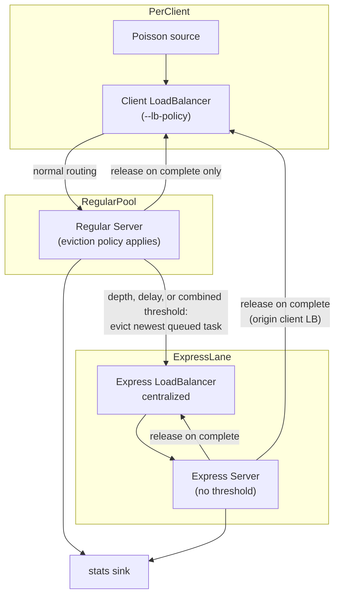

# Express Lane Mode

Express lane mode adds a dedicated overflow path for tasks that would otherwise wait too long in regular-server queues. Regular servers evict excess queued work to a shared express load balancer, which routes to a separate pool of express servers using centralized (pull-based) policy.

**lb only** — not available in the microservice simulator (`ms`). See [lb-vs-ms.md](lb-vs-ms.md).

Enable with `--expresslane`, which requires `--express-size` and at least one of `--express-th` or `--express-del-th` (both may be set).

## Topology

With `--servers 10 --express-size 2`:

- **Regular pool:** servers 0–7 (client LBs route here only)
- **Express pool:** servers 8–9 (express LB routes here only)



## Parameters

| Flag | Role |
|------|------|
| `--expresslane` | Enable express-lane mode |
| `--express-size` | Number of express servers (last N in the pool) |
| `--express-th` | Max regular-server queue depth; when exceeded, the newest queued task is evicted to the express LB |
| `--express-del-th` | Max queueing delay (seconds); eviction triggers when head-of-line wait or projected delay exceeds this threshold (see delay mode below) |
| `--ideal` | With `--express-del-th` only (not with `--express-th`), immediate eviction when either in-flight elapsed time or projected delay exceeds threshold (see below) |
| `--servers` | Total pool size (regular + express) |
| `--lb-policy` | Load-balancing policy for client LBs → regular pool only |
| `--lb-subset-size` | Subset size over **regular** servers only (e.g. 8, not 10, when 2 are express) |

At least one of `--express-th` and `--express-del-th` must be set when `--expresslane` is enabled. Both may be set together (combined mode).

## Compatibility

**`--lb-policy centralized` is not supported with `--expresslane`.** The simulator rejects the combination at startup. Express lane requires push-based client load balancers and regular-server queue eviction; centralized policy on client LBs holds all backlog at the central dispatcher with no server-side queues.

The express load balancer always uses centralized (pull-based) dispatch regardless of `--lb-policy`. That flag applies to client LBs routing to the regular pool only.

## Client LB subset isolation

Client load balancers never see express servers. Subset assignment (`--lb-subset-size`, `--lb-subset-policy`) operates on the regular pool only:

```
n_regular = servers - express_size
```

Example: `--servers 10 --express-size 2` → client LBs subset among 8 servers (indices 0–7). Express servers (indices 8–9) are invisible to client LBs.

## Eviction policy (regular servers only)

When a regular server is at capacity (`in_flight == concurrency`), incoming tasks are queued. After enqueue, one of depth-only, delay-only, or combined eviction applies:

### Depth mode (`--express-th` only)

1. If `queue.len() > express_th`, pop the **newest** task (back of the FIFO queue).
2. Forward it to the express load balancer.
3. **Do not** send a release to the client LB on eviction.

### Delay mode (`--express-del-th` only)

Delay mode evicts queued tasks when queueing delay exceeds `--express-del-th`. On each new enqueue (while the server is at capacity), eviction is triggered if **either** condition holds:

| Trigger | Condition | Default (monitored) | `--ideal` |
|---------|-----------|---------------------|-----------|
| **Head-of-line wait** | `max(now - service_started_at) > express_del_th` over in-flight tasks | Immediate eviction | Immediate eviction |
| **Projected delay** | `ideal_delay > express_del_th` | Schedule timer at `express_del_th` later | Immediate eviction |

Head-of-line wait measures how long the longest-running in-flight request has been processing since service started (`service_started_at`, set when the server begins the task). Immediate eviction always pops the **newest** task (back of the FIFO queue).

Projected delay for a newly queued task (back of the FIFO queue):

```
ideal_delay = sum(task.duration for task in queue)
            + min(task.duration - (now - service_started_at) for each in-flight task)
```

- Queued tasks contribute their full sampled service time (`Task.duration`).
- In-flight tasks contribute **remaining** service time (duration minus elapsed since service started).
- With `--concurrency > 1`, the minimum remaining time among all in-flight tasks is used (time until the earliest slot frees).

Because the simulator cannot observe live wait time the way a real system would, projected delay uses this work-based estimate to decide whether a task will exceed the threshold, then schedules eviction accordingly.

#### Monitored delay (default)

When a task is enqueued:

1. If head-of-line wait exceeds the threshold, pop the **newest** task and forward it to the express load balancer immediately.
2. Otherwise, if `ideal_delay > express_del_th`, schedule a keyed eviction event at `express_del_th` seconds later (simulating eviction once the task's monitored wait time reaches the threshold).
3. If the task starts service before the timer fires, cancel the pending eviction.
4. When the timer fires, if the task is still queued, remove it and forward to the express load balancer.
5. **Do not** send a release to the client LB on eviction.

Example (projected delay): threshold = 2s, task enqueued at t=10 with projected wait 5s → eviction scheduled at t=12. If still queued at t=12, the task is evicted; if the queue drained and the task started service before t=12, no eviction occurs.

Example (head-of-line wait): threshold = 2s, in-flight task started service at t=1.0, new task enqueued at t=3.5 → elapsed service time is 2.5s (> 2s), so the new arrival is evicted immediately even if its projected delay alone would not schedule a timer.

#### Ideal delay mode (`--ideal`)

When `--ideal` is passed with `--express-del-th`, eviction is **immediate** on enqueue if **either** head-of-line wait **or** projected delay exceeds the threshold — same pop-and-forward behavior, but without the threshold timer delay.

Ideal mode is an oracle baseline: it assumes service times are known at enqueue time (as they are in this simulator) and evicts as soon as either trigger fires. Default monitored mode is more conservative for the projected-delay path: eviction happens only after the task has waited `express_del_th` seconds in the queue (unless in-flight elapsed time or service start intervenes first).

`--ideal` cannot be combined with `--express-th`.

### Combined mode (`--express-th` and `--express-del-th`)

When both thresholds are set, eviction is triggered if **any** of three conditions holds (always monitored delay semantics for the delay triggers):

| # | Condition | Action |
|---|-----------|--------|
| 1 | `queue.len() > express_th` | Immediate eviction |
| 2 | `max(now - service_started_at) > express_del_th` over in-flight tasks | Immediate eviction |
| 3 | `ideal_delay > express_del_th` | Schedule timer at `express_del_th` later |

Evaluation order on enqueue: depth check first, then in-flight elapsed time, then projected-delay timer scheduling. Same pop-newest behavior as depth and delay modes.

Express servers have no eviction policy — they accept and process whatever the express LB sends.

## Release lifecycle (deferred client release)

Client LBs track `local_inflight[origin_server_idx]` from dispatch until the task fully completes. A task evicted to the express lane remains in-flight from the client LB's perspective until an express server finishes it.

Each task carries:

| Field | Set by | Purpose |
|-------|--------|---------|
| `lb_id` | Client LB on dispatch | Originating client load balancer |
| `origin_server_idx` | Client LB on dispatch | Regular server the client routed to |

The express LB preserves both fields when re-dispatching.

| Stage | Release sent? |
|-------|---------------|
| Client LB → regular server | no |
| Regular server → express LB (evict) | **no** |
| Express LB → express server | no |
| Regular server complete (normal path) | client LB with `server_idx` |
| Express server complete | express LB with express `server_idx` **and** client LB with `origin_server_idx` |

On express completion, the client LB release uses `origin_server_idx` (the regular server originally chosen), not the express server index.

## Examples

Queue-depth eviction:

```bash
./target/release/lb --expresslane --servers 10 --express-size 2 --express-th 5 \
  --load 0.9 --n 100000 --lb-policy power-of-two
```

Queueing-delay eviction (monitored, default):

```bash
./target/release/lb --expresslane --servers 10 --express-size 2 --express-del-th 0.5 \
  --load 0.9 --n 100000 --lb-policy power-of-two
```

Ideal delay eviction (immediate oracle baseline):

```bash
./target/release/lb --expresslane --servers 10 --express-size 2 --express-del-th 0.5 --ideal \
  --load 0.9 --n 100000 --lb-policy power-of-two
```

Combined depth and delay eviction:

```bash
./target/release/lb --expresslane --servers 10 --express-size 2 --express-th 5 --express-del-th 0.5 \
  --load 0.9 --n 100000 --lb-policy power-of-two
```

These run 8 regular servers with power-of-two client routing, evicting overflow to 2 express servers via a centralized express load balancer.

## Metrics

When `--expresslane` is enabled, the simulator reports split metrics alongside the usual overall values.

### Utilization

| Field | Definition |
|-------|------------|
| `utilization_pct` | Overall: `sum(duration) / (observation × servers × concurrency) × 100` |
| `regular_utilization_pct` | Regular pool only: busy time on regular servers / (observation × n_regular × concurrency) × 100 |
| `express_utilization_pct` | Express pool only: busy time on express servers / (observation × express_size × concurrency) × 100 |

Tasks are classified by where they were **processed**: evicted tasks that finish on an express server count toward express utilization; tasks that never leave the regular pool count toward regular utilization.

### End-to-end latency

| Field | Definition |
|-------|------------|
| `e2e` | Overall: `finish - start` per completed task |
| `regular_e2e` | Same formula, tasks processed on regular servers |
| `express_e2e` | Same formula, tasks processed on express servers (evicted tasks) |

### Queueing delay

| Field | Definition |
|-------|------------|
| `queueing_delays` | Overall: `(finish - start) - duration` per completed task |
| `regular_queueing_delays` | Same formula, tasks processed on regular servers |
| `express_queueing_delays` | Same formula, tasks processed on express servers (total wait) |
| `pre_eviction_queueing_delays` | Evicted tasks only: `evicted_at - start` |
| `post_eviction_queueing_delays` | Evicted tasks only: `service_started_at - evicted_at` |

For evicted tasks, `pre_eviction + post_eviction = express_queueing_delay` (total queueing from arrival through express service start).

Express queueing delay includes time spent waiting on the regular path before eviction and time waiting on the express path after eviction.

### Human output (express mode)

```
[rates, utilization, unloaded p99, SLO]
e2e latency (s):              # overall
processing time (s):          # overall
queueing delay (s):           # overall

--- regular tasks (N=...) ---
e2e latency (s):
queueing delay (s):

--- evicted tasks (N=...) ---
e2e latency (s):
queueing delay (s):              # total express queueing
pre-eviction queueing delay (s):
post-eviction queueing delay (s):
```

Split fields appear in human output and JSON only when `--expresslane` is set. Non-express runs emit the overall metrics unchanged.
