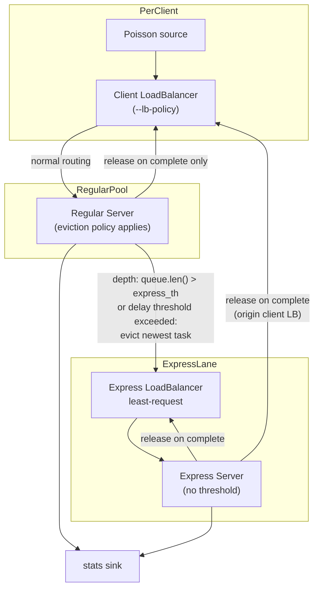

# Express Lane Mode

Express lane mode adds a dedicated overflow path for tasks that would otherwise wait too long in regular-server queues. Regular servers evict excess queued work to a shared express load balancer, which routes to a separate pool of express servers using least-request policy.

**lb only** — not available in the microservice simulator (`ms`). See [lb-vs-ms.md](lb-vs-ms.md).

Enable with `--expresslane`, which requires `--express-size` and exactly one of `--express-th` or `--express-del-th`.

## Topology

With `--servers 10 --express-size 2`:

- **Regular pool:** servers 0–7 (client LBs route here only)
- **Express pool:** servers 8–9 (express LB routes here only)



## Parameters

| Flag | Role |
|------|------|
| `--expresslane` | Enable express-lane mode |
| `--express-size` | Number of express servers (last N in the pool) |
| `--express-th` | Max regular-server queue depth; when exceeded, the newest queued task is evicted to the express LB |
| `--express-del-th` | Max queueing delay (seconds) at the head of the regular-server queue; when exceeded on a new arrival, the newest queued task is evicted to the express LB |
| `--ideal` | With `--express-del-th`, use work-based delay estimate instead of head-of-line wall-clock wait (see below) |
| `--servers` | Total pool size (regular + express) |
| `--lb-policy` | Load-balancing policy for client LBs → regular pool only |
| `--lb-subset-size` | Subset size over **regular** servers only (e.g. 8, not 10, when 2 are express) |

Exactly one of `--express-th` and `--express-del-th` must be set when `--expresslane` is enabled.

## Compatibility

**`--lb-policy centralized` is not supported with `--expresslane`.** The simulator rejects the combination at startup. Express lane requires push-based client load balancers and regular-server queue eviction; centralized policy holds all backlog at the central dispatcher with no server-side queues.

## Client LB subset isolation

Client load balancers never see express servers. Subset assignment (`--lb-subset-size`, `--lb-subset-policy`) operates on the regular pool only:

```
n_regular = servers - express_size
```

Example: `--servers 10 --express-size 2` → client LBs subset among 8 servers (indices 0–7). Express servers (indices 8–9) are invisible to client LBs.

## Eviction policy (regular servers only)

When a regular server is at capacity (`in_flight == concurrency`), incoming tasks are queued. After enqueue, one of two eviction policies applies:

### Depth mode (`--express-th`)

1. If `queue.len() > express_th`, pop the **newest** task (back of the FIFO queue).
2. Forward it to the express load balancer.
3. **Do not** send a release to the client LB on eviction.

### Delay mode (`--express-del-th`)

1. Compute queueing delay as `now - queue[0].start`, where `queue[0]` is the oldest task in the queue and `Task.start` is the task’s system arrival time (set when the Poisson source creates the task).
2. If the delay is **greater than** `--express-del-th` (seconds), pop the **newest** task (back of the FIFO queue).
3. Forward it to the express load balancer.
4. **Do not** send a release to the client LB on eviction.

Delay mode evicts new arrivals when the head-of-line task has already been waiting longer than the threshold, even if the queue is shallow.

#### Ideal delay mode (`--ideal`)

When `--ideal` is passed with `--express-del-th`, eviction uses a **work-based backlog estimate** instead of head-of-line wall-clock wait:

```
ideal_delay = sum(task.duration for task in queue)
            + min(task.duration - (now - service_started_at) for each in-flight task)
```

- Queued tasks contribute their full sampled service time (`Task.duration`).
- In-flight tasks contribute **remaining** service time (duration minus elapsed since service started).
- With `--concurrency > 1`, the minimum remaining time among all in-flight tasks is used (time until the earliest slot frees).

If `ideal_delay > express_del_th`, the newest queued task is evicted — same pop-and-forward behavior as default delay mode.

Ideal mode assumes service times are known at enqueue time (as they are in this simulator). Default delay mode measures how long the oldest queued task has been waiting in wall-clock time, which can diverge from remaining work when service times vary or servers are concurrently busy.

Express servers have no eviction policy — they accept and process whatever the express LB sends.

## Release lifecycle (deferred client release)

Client LBs track `local_inflight[origin_server_idx]` from dispatch until the task fully completes. A task evicted to the express lane remains in-flight from the client LB's perspective until an express server finishes it.

Each task carries:

| Field | Set by | Purpose |
|-------|--------|---------|
| `lb_id` | Client LB on dispatch | Originating client load balancer |
| `origin_server_idx` | Client LB on dispatch | Regular server the client routed to |

The express LB preserves both fields when re-dispatching.

| Stage | Release sent? |
|-------|---------------|
| Client LB → regular server | no |
| Regular server → express LB (evict) | **no** |
| Express LB → express server | no |
| Regular server complete (normal path) | client LB with `server_idx` |
| Express server complete | express LB with express `server_idx` **and** client LB with `origin_server_idx` |

On express completion, the client LB release uses `origin_server_idx` (the regular server originally chosen), not the express server index.

## Examples

Queue-depth eviction:

```bash
./target/release/lb --expresslane --servers 10 --express-size 2 --express-th 5 \
  --load 0.9 --n 100000 --lb-policy power-of-two
```

Queueing-delay eviction:

```bash
./target/release/lb --expresslane --servers 10 --express-size 2 --express-del-th 0.5 \
  --load 0.9 --n 100000 --lb-policy power-of-two
```

Ideal delay eviction (work-based threshold):

```bash
./target/release/lb --expresslane --servers 10 --express-size 2 --express-del-th 0.5 --ideal \
  --load 0.9 --n 100000 --lb-policy power-of-two
```

Both run 8 regular servers with power-of-two client routing, evicting overflow to 2 express servers via a least-request express load balancer.

## Metrics

When `--expresslane` is enabled, the simulator reports split metrics alongside the usual overall values.

### Utilization

| Field | Definition |
|-------|------------|
| `utilization_pct` | Overall: `sum(duration) / (observation × servers × concurrency) × 100` |
| `regular_utilization_pct` | Regular pool only: busy time on regular servers / (observation × n_regular × concurrency) × 100 |
| `express_utilization_pct` | Express pool only: busy time on express servers / (observation × express_size × concurrency) × 100 |

Tasks are classified by where they were **processed**: evicted tasks that finish on an express server count toward express utilization; tasks that never leave the regular pool count toward regular utilization.

### End-to-end latency

| Field | Definition |
|-------|------------|
| `e2e` | Overall: `finish - start` per completed task |
| `regular_e2e` | Same formula, tasks processed on regular servers |
| `express_e2e` | Same formula, tasks processed on express servers (evicted tasks) |

### Queueing delay

| Field | Definition |
|-------|------------|
| `queueing_delays` | Overall: `(finish - start) - duration` per completed task |
| `regular_queueing_delays` | Same formula, tasks processed on regular servers |
| `express_queueing_delays` | Same formula, tasks processed on express servers (total wait) |
| `pre_eviction_queueing_delays` | Evicted tasks only: `evicted_at - start` |
| `post_eviction_queueing_delays` | Evicted tasks only: `service_started_at - evicted_at` |

For evicted tasks, `pre_eviction + post_eviction = express_queueing_delay` (total queueing from arrival through express service start).

Express queueing delay includes time spent waiting on the regular path before eviction and time waiting on the express path after eviction.

### Human output (express mode)

```
[rates, utilization, unloaded p99, SLO]
e2e latency (s):              # overall
processing time (s):          # overall
queueing delay (s):           # overall

--- regular tasks (N=...) ---
e2e latency (s):
queueing delay (s):

--- evicted tasks (N=...) ---
e2e latency (s):
queueing delay (s):              # total express queueing
pre-eviction queueing delay (s):
post-eviction queueing delay (s):
```

Split fields appear in human output and JSON only when `--expresslane` is set. Non-express runs emit the overall metrics unchanged.
