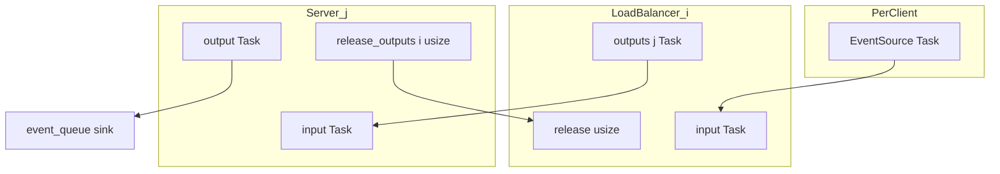

# Load Balancer Simulation (`lb`)

This document describes how the main load-balancer simulator works: simulation entities, port wiring, task flow, load-balancing behavior, and metrics. The simulator is implemented as the `lb` binary and the modules `src/main.rs`, `src/load_balancer.rs`, `src/server.rs`, and `src/policy.rs`.

## Overview

The simulator models a pool of FCFS servers with configurable concurrency (CPU cores). Tasks arrive as independent Poisson processes from one or more clients, are routed by each client's load balancer to a shared server pool, and complete with sampled service times. Completed tasks are collected in a shared sink for post-run metrics.

```
Poisson source(s) ──▶ LoadBalancer(s) ──▶ Server(s) ──▶ shared stats sink
                            ▲                  │
                            └── release ───────┘
```

With `--clients 1`, this reduces to a single source → load balancer → servers path.

## Simulation entities

| Entity | Count | Role |
|--------|-------|------|
| **Poisson source** (`exp_source` in `src/main.rs`) | one per client | Schedules `Task` arrivals at derived inter-arrival times |
| **LoadBalancer** (`src/load_balancer.rs`) | `--clients` | Routes tasks to servers via a pluggable policy |
| **Server** (`src/server.rs`) | `--servers` | FCFS queue + `--concurrency` concurrent workers |
| **Stats sink** (`event_queue`) | 1 shared | Collects completed tasks for post-run metrics |

Each entity is a [nexosim](https://github.com/asynchronics/nexosim) model with a mailbox. Messages are delivered asynchronously to model handler methods (`input`, `release`, etc.).

## Port and mailbox wiring

Simulation assembly happens in `run_simulation()` in `src/main.rs`. The graph below shows message types and connections for client `i` and server `j`.



### LoadBalancer

Each load balancer has:

- **One mailbox** shared by two input handlers on the same address:
  - `LoadBalancer::input` — receives `Task` from the client's Poisson source
  - `LoadBalancer::release` — receives `usize` (server index) when a task completes
- **`outputs: Vec<Output<Task>>`** — length equals total server count; `outputs[j]` connects to `Server::input` on server `j`'s mailbox

All load balancers connect to all servers. Subset restrictions (`--lb-subset-size`, `--lb-subset-policy`) affect routing choices only, not wiring.

### Server

Each server has:

- **`input`** — receives `Task` from any load balancer
- **`output`** — sends completed `Task` to the shared stats sink
- **`release_outputs: Vec<Output<usize>>`** — one output per client load balancer; on completion, sends `server_idx` to the originating LB's `release` handler (identified via `task.lb_id`)

### Stats sink

All servers connect `output` to the same `event_queue` sink. After `simu.run()`, `calculate_stats()` reads completed tasks from the sink.

### Wiring summary

```
For each client i:
    Poisson source ──▶ LoadBalancer_i.input

For each load balancer i and server j:
    LoadBalancer_i.outputs[j] ──▶ Server_j.input

For each server j and client i:
    Server_j.release_outputs[i] ──▶ LoadBalancer_i.release

For each server j:
    Server_j.output ──▶ shared stats sink
```

## Task lifecycle

A **Task** is the unit of work flowing through the simulation.

| Field | Set when | Purpose |
|-------|----------|---------|
| `start` | Poisson source | E2e latency start time |
| `duration` | Poisson source | Sampled service time (exponential or constant) |
| `finish` | `Server::complete` | E2e latency end time |
| `lb_id` | LoadBalancer before dispatch | Routes release notification back to the correct LB |

### End-to-end flow

1. **Arrival.** `exp_source` schedules `Task { start, duration }` to the client's load balancer `input`.
2. **Routing.** The load balancer fills a scratch buffer with load values for servers in its subset (true load for power-of-two; local inflight for other policies), calls the policy to pick a server, increments `local_inflight[server]`, sets `task.lb_id`, and sends the task on `outputs[server]`.
3. **Queueing.** The server accepts the task into service immediately if `in_flight < max_concurrency`, otherwise pushes it onto a FIFO queue.
4. **Service.** `begin_service` increments `in_flight` and schedules a completion event after `task.duration`.
5. **Completion.** `Server::complete` sets `finish`, sends the task to the stats sink, sends `server_idx` on `release_outputs[task.lb_id]`, decrements `in_flight`, and drains the queue.
6. **Release.** The load balancer's `release` handler decrements `local_inflight[server_idx]`.

## Load balancing

Policies live in `src/policy.rs` and implement `LoadBalancePolicy::select(&mut self, loads: &[u32]) -> usize`, returning an index into the load balancer's server subset.

### Local inflight load

Each load balancer maintains `local_inflight: Vec<u32>` with one counter per server in the pool. A counter tracks requests **this balancer has dispatched but not yet received a release for**. It does not reflect:

- Other load balancers' traffic to the same server
- Tasks waiting in the server's queue
- Tasks currently being processed that were sent by a different client

This models partial observability: the balancer only sees its own outstanding requests.

When routing with **least-request**, the load balancer copies subset loads into `load_scratch`:

```
for each server in server_indices:
    load_scratch[k] = local_inflight[server_indices[k]]
```

### True load (power-of-two)

Each server publishes its current load — `in_flight + queue.len()` — to a shared `LoadRegistry` on every state change. When routing with **power-of-two**, the load balancer reads these values at decision time:

```
for each server in server_indices:
    load_scratch[k] = load_registry.get(server_indices[k])
```

This models load probes against downstream servers: all load balancers see the same queue depth and in-flight work, not just their own outstanding dispatches. The routed request is not counted until the server receives it.

### Server subset

Each load balancer is assigned a subset of servers at startup via `--lb-subset-size` and `--lb-subset-policy`:

- `0` (default) — all servers
- `k > 0` — `min(k, servers)` servers per balancer

**Subset policies** (`--lb-subset-policy`, default `deterministic`):

| Policy | Behavior |
|--------|----------|
| **deterministic** | Partition clients into rounds of size `n // k`. Within each round, shuffle all server indices with a seed derived from the round number, then assign each client a disjoint slice of size `k`. Client id is the load balancer index (`0 .. clients-1`). |
| **random** | Shuffle all server indices and take the first `k` (independent per load balancer). |

The load-balancing policy only chooses among servers in this subset.

### Policies

| Policy | CLI flag | Behavior |
|--------|----------|----------|
| **power-of-two** | `--lb-policy power-of-two` (default) | Sample two random servers from the subset; route to the one with lower true load (`in_flight + queue depth`) |
| **least-request** | `--lb-policy least-request` | Route to the server with lowest local inflight; random tie-break among minima |
| **random** | `--lb-policy random` | Uniform random server from the subset (ignores load slice) |
| **round-robin** | `--lb-policy round-robin` | Cycle through a randomly shuffled order of subset servers (ignores load slice) |

Local inflight tracking runs for all policies so switching `--lb-policy` does not require different wiring.

## Server concurrency model

Each server models a multi-core machine with a single FCFS queue:

- **`max_concurrency`** — number of tasks that can run in parallel (from `--concurrency`)
- **`in_flight`** — tasks currently being processed
- **`queue`** — FIFO buffer for tasks waiting for a free slot

On `input`, if capacity is available the task starts immediately; otherwise it is queued. On `complete`, a slot frees up and `drain_queue` starts the next waiting task if any.

There is no preemption and no priority classes.

## Arrival rate and load

For `exponential` and `constant` service distributions, the service time mean is fixed at 1 second (`SERVICE_MEAN` in `src/main.rs`). For `bimodal`, the mean is the mixture expected value `E[S] = p1·m1 + p2·m2` from `--service-modes` and `--service-mode-probs`.

Inter-arrival time is derived from target utilization `--load`, service mean, and total system capacity:

```
total_capacity = servers × concurrency
arrival_mean = service_mean / (load × total_capacity)
```

With the default exponential/constant service mean of 1 s: `arrival_mean = 1 / (load × servers × concurrency)`.

With multiple clients (`--clients C`), each client runs an independent Poisson source at a slower rate so aggregate load is unchanged:

```
per_client_arrival_mean = arrival_mean × clients
```

Total task count `--n` is split evenly across clients via `split_tasks()` (remainder goes to the first clients).

Service duration is sampled per task as:

- **exponential** (default): `Exp(mean = 1 s)`
- **constant**: fixed 1 s
- **bimodal**: pick mode `i` with probability `p_i`, then sample `Exp(mean = m_i)`

Example bimodal run:

```bash
./target/release/lb --service-dist bimodal \
  --service-modes 0.1,1.0 --service-mode-probs 0.9,0.1
# E[S] = 0.19 s → faster arrivals than the default 1 s mean
```

## Metrics

After the simulation completes, `calculate_stats()` reads all completed tasks from the sink.

| Metric | Definition |
|--------|------------|
| **utilization_pct** | `sum(task.duration) / (observation_time × total_capacity) × 100` |
| **unloaded_latency_p99** | 99th percentile of sampled service durations |
| **e2e** | `finish - start` per task (seconds) |
| **queueing_delays** | `(finish - start) - duration` per task (seconds) |

When `--slo` is provided (latency threshold in seconds), the simulator also reports **prob_latency_gt_slo** — the fraction of requests with `e2e > slo`. In human output this appears as `P(latency > SLO)`. Without `--slo`, no SLO fields are emitted.

Output format is controlled by `--format human` (percentile tables) or `--format json`.

## What is NOT modeled

- Network latency between client, load balancer, and server
- Failures, retries, or timeouts
- Request cancellation
- Cross–load-balancer load visibility for least-request (each LB sees only its own inflight counts)
- True load visibility for least-request, random, or round-robin (only power-of-two reads shared load)
- Connection limits or backpressure on load balancer outputs

## Source file map

| File | Responsibility |
|------|----------------|
| `src/main.rs` | CLI, simulation assembly, Poisson source, metrics |
| `src/load_registry.rs` | Shared true-load store for power-of-two |
| `src/load_balancer.rs` | Routing, local inflight tracking, release handler |
| `src/server.rs` | Queueing, concurrency, completion, release notifications, load publishing |
| `src/policy.rs` | Load-balancing algorithms |
