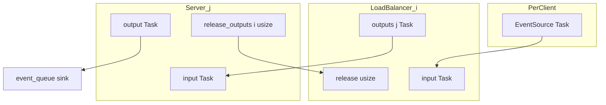
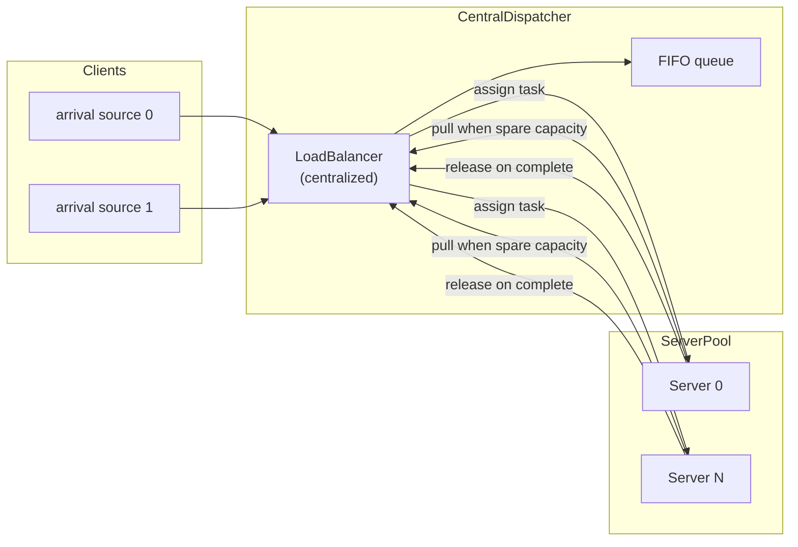
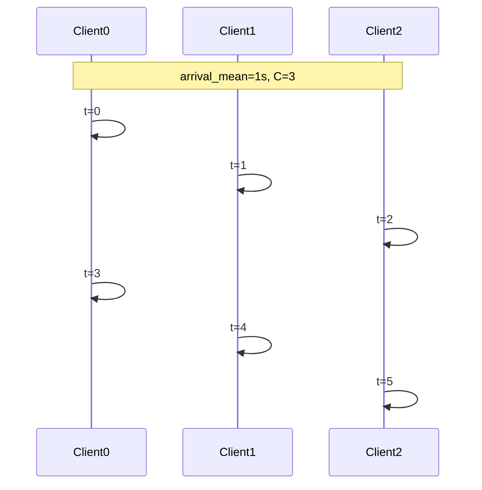

# Load Balancer Simulation (`lb`)

This document describes how the main load-balancer simulator works: simulation entities, port wiring, task flow, load-balancing behavior, and metrics. The simulator is implemented as the `lb` binary and the modules `src/main.rs`, `src/load_balancer.rs`, `src/server.rs`, and `src/policy.rs`.

See also: [lb-vs-ms.md](lb-vs-ms.md) for a feature comparison with the microservice simulator.

## Overview

The simulator models a pool of FCFS servers with configurable concurrency (CPU cores). Tasks arrive from one or more clients with exponential (Poisson, default) or constant inter-arrival times (`--arrival`), are routed to a shared server pool, and complete with sampled service times. Completed tasks are collected in a shared sink for post-run metrics.

**Push policies** (default): each client has its own load balancer that pushes tasks to servers on arrival.

```
arrival source(s) ──▶ LoadBalancer(s) ──▶ Server(s) ──▶ shared stats sink
                            ▲                  │
                            └── release ───────┘
```

**Centralized policy** (`--lb-policy centralized`): one global queue at a single dispatcher; servers pull work when they have spare capacity. See [Centralized policy (pull-based)](#centralized-policy-pull-based).

With `--clients 1` and a push policy, this reduces to a single source → load balancer → servers path.

## Simulation entities

| Entity | Count (push policies) | Count (`centralized`) | Role |
|--------|----------------------|------------------------|------|
| **Arrival source** (`task_source` in `src/main.rs`) | one per client | one per client | Schedules `Task` arrivals with exponential or constant inter-arrival gaps |
| **LoadBalancer** (`src/load_balancer.rs`) | `--clients` | **1** | Routes tasks to servers (push on arrival, or pull-based queue) |
| **Server** (`src/server.rs`) | `--servers` | `--servers` | FCFS queue + `--concurrency` concurrent workers (no local queue under centralized) |
| **Stats sink** (`event_queue`) | 1 shared | 1 shared | Collects completed tasks for post-run metrics |

Each entity is a [nexosim](https://github.com/asynchronics/nexosim) model with a mailbox. Messages are delivered asynchronously to model handler methods (`input`, `release`, etc.).

## Port and mailbox wiring

Simulation assembly happens in `run_simulation()` in `src/main.rs`. The graph below shows message types and connections for client `i` and server `j`.



### LoadBalancer

Each load balancer has:

- **One mailbox** shared by two input handlers on the same address:
  - `LoadBalancer::input` — receives `Task` from the client's arrival source
  - `LoadBalancer::release` — receives `usize` (server index) when a task completes
- **`outputs: Vec<Output<Task>>`** — length equals total server count; `outputs[j]` connects to `Server::input` on server `j`'s mailbox

All load balancers connect to all servers. Subset restrictions (`--lb-subset-size`, `--lb-subset-policy`) affect routing choices only, not wiring.

### Server

Each server has:

- **`input`** — receives `Task` from any load balancer
- **`output`** — sends completed `Task` to the shared stats sink
- **`release_outputs: Vec<Output<usize>>`** — one output per client load balancer; on completion, sends `server_idx` to the originating LB's `release` handler (identified via `task.lb_id`)
- **`shed_outputs: Vec<Output<Task>>`** (when `--shed-delay` is set) — one output per client load balancer; on shed, returns the task to that LB's `input` for re-routing

### Stats sink

All servers connect `output` to the same `event_queue` sink. After `simu.run()`, `calculate_stats()` reads completed tasks from the sink.

### Execution model

Simulations always run on a **single-threaded** nexosim executor (`SimInit::with_num_threads(1)`). Multi-threaded execution caused severe scheduler lock contention on this workload without improving throughput. `--seed` controls RNG reproducibility only; it is not required for fast runs.

### Wiring summary

```
For each client i:
    arrival source ──▶ LoadBalancer_i.input

For each load balancer i and server j:
    LoadBalancer_i.outputs[j] ──▶ Server_j.input

For each server j and client i:
    Server_j.release_outputs[i] ──▶ LoadBalancer_i.release

For each server j and client i (when --shed-delay is set):
    Server_j.shed_outputs[i] ──▶ LoadBalancer_i.input

For each server j:
    Server_j.output ──▶ shared stats sink
```

## Task lifecycle

A **Task** is the unit of work flowing through the simulation.

| Field | Set when | Purpose |
|-------|----------|---------|
| `start` | Arrival source | E2e latency start time |
| `task_id` | LoadBalancer on approx arrival | Per-client-LB monotonic id; carried on pull intents; used for bound pull lookup unless `--no-bind` |
| `duration` | Arrival source | Sampled service time (exponential, constant, or bimodal) |
| `finish` | `Server::complete` | E2e latency end time |
| `lb_id` | LoadBalancer before dispatch | Routes release notification back to the correct LB |
| `shed_at` | `Server::forward_shed` | Timestamp when a shed task was returned to the LB (only when `--shed-delay` is set) |

### End-to-end flow

1. **Arrival.** `task_source` schedules `Task { start, duration }` to the client's load balancer `input`.
2. **Routing.** The load balancer fills a scratch buffer with local inflight values for servers in its subset, calls the policy to pick a server, increments `local_inflight[server]`, sets `task.lb_id`, and sends the task on `outputs[server]`.
3. **Queueing.** The server accepts the task into service immediately if `in_flight < max_concurrency`, otherwise pushes it onto a FIFO queue. With `--shed-delay`, the server may return the newest queued task to the originating LB if queueing delay exceeds the threshold (see [work-shedding.md](work-shedding.md)).
4. **Service.** `begin_service` increments `in_flight` and schedules a completion event after `task.duration`.
5. **Completion.** `Server::complete` sets `finish`, sends the task to the stats sink, sends `server_idx` on `release_outputs[task.lb_id]`, decrements `in_flight`, and drains the queue.
6. **Release.** The load balancer's `release` handler decrements `local_inflight[server_idx]`.

## Load balancing

Policies live in `src/policy.rs` and implement `LoadBalancePolicy::select(&mut self, loads: &[u32]) -> usize`, returning an index into the load balancer's server subset.

### Local inflight load

Each load balancer maintains `local_inflight: Vec<u32>` with one counter per server in the pool. A counter tracks requests **this balancer has dispatched but not yet received a release for**. It does not reflect:

- Other load balancers' traffic to the same server
- Tasks waiting in the server's queue
- Tasks currently being processed that were sent by a different client

This models partial observability: the balancer only sees its own outstanding requests.

All push policies fill the load slice from local inflight before calling `select()`:

```
for each server in server_indices:
    load_scratch[k] = local_inflight[server_indices[k]]
```

### Server subset

Each load balancer is assigned a subset of servers at startup via `--lb-subset-size` and `--lb-subset-policy`:

- `0` (default) — all servers
- `k > 0` — `min(k, servers)` servers per balancer

**Subset policies** (`--lb-subset-policy`, default `deterministic`):

| Policy | Behavior |
|--------|----------|
| **deterministic** | Partition clients into rounds of size `n // k`. Within each round, shuffle all server indices with a seed derived from the round number, then assign each client a disjoint slice of size `k`. Client id is the load balancer index (`0 .. clients-1`). |
| **random** | Shuffle all server indices and take the first `k` (independent per load balancer). |

The load-balancing policy only chooses among servers in this subset.

### Policies

| Policy | CLI flag | Behavior |
|--------|----------|----------|
| **power-of-two** | `--lb-policy power-of-two` (default) | Sample two random servers from the subset; route to the one with lower local inflight |
| **least-request** | `--lb-policy least-request` | Route to the server with lowest local inflight; random tie-break among minima |
| **random** | `--lb-policy random` | Uniform random server from the subset (ignores load slice) |
| **round-robin** | `--lb-policy round-robin` | Cycle through a randomly shuffled order of subset servers (ignores load slice) |
| **centralized** | `--lb-policy centralized` | Pull-based: global FIFO queue at one dispatcher; servers request work on spare capacity ([details below](#centralized-policy-pull-based)) |
| **approx** | `--lb-policy approx` + `--pull-policy` | Decentralized pull: per-client FIFO queues; `--pull-policy` selects pull-intent target ([details in approx-policy.md](approx-policy.md)) |

Local inflight tracking runs for all push policies so switching among them does not require different wiring. Under **approx**, server selection uses outstanding pull-intent counts instead of local inflight.

## Centralized policy (pull-based)

With `--lb-policy centralized`, routing is **pull-based** instead of push-on-arrival. This is an architecture change, not a fifth `select()` algorithm — dispatch logic lives in queue and pull handlers on `LoadBalancer`, not in `LoadBalancePolicy::select()`.



### Design choices

| Choice | Decision | Rationale / implications |
|--------|----------|--------------------------|
| **Simulator scope** | `lb`: global flat pool | `ms`: one pull queue per downstream target (outbound only; ingress stays push P2C). See [microservice-simulation.md](microservice-simulation.md#centralized-policy-pull-based-layer). |
| **Push vs pull** | Pull-based | Push policies call `select()` on arrival. Centralized queues tasks at the LB; servers initiate assignment. |
| **Queue location** | Single global queue at one central `LoadBalancer` | Even with `--clients > 1`, all arrival sources feed the same dispatcher; per-client LBs are **not** created. |
| **Multi-client semantics** | Arrivals split, routing unified | `--clients C` still creates C arrival sources and splits `--n` across them (aggregate rate unchanged). Routing is through one queue — this does **not** model multiple independent frontends with partial observability. |
| **Subset routing** | Ignored when centralized | `--lb-subset-size` and `--lb-subset-policy` have no effect; all servers pull from the global queue. |
| **Pull trigger** | Spare capacity | A server sends a pull whenever `in_flight < max_concurrency`. One pull requests one task; after each completion, one new pull is sent. At sim start, `concurrency` pulls per server are scheduled so the pool is warm. |
| **Assignment order** | FCFS on both sides | Tasks dequeue from the front of the LB queue. Waiting pullers are tracked in FIFO order. First waiter gets the next task — no load comparison or random tie-break. |
| **Server queueing** | Disabled | Regular servers never enqueue locally; all backlog lives at the central LB. Server `input` always starts service immediately. |
| **Load visibility** | No load probes | Centralized does not use load values for routing (only `local_inflight` for release accounting). |
| **Release lifecycle** | Same inflight accounting | `local_inflight` increments on dispatch (pull matched), decrements on `release` at completion. Single central LB (`lb_id = 0`) for all tasks. |
| **Express lane** | Not supported for client `--lb-policy centralized` | `--expresslane` cannot be combined with client `--lb-policy centralized`. Express lane uses an internal centralized express LB. |
| **Policy trait** | `select()` unused | `LoadBalancePolicyKind::Centralized` exists for CLI parity; dispatch logic lives in `LoadBalancer` pull/queue handlers. |

### Port wiring (centralized)

- **`LoadBalancer::input`** — receives `Task` from all arrival sources; enqueues and tries to match waiting pullers
- **`LoadBalancer::pull`** — receives `usize` (server index); dispatches a queued task or records the server as waiting
- **`LoadBalancer::release`** — receives `usize` (server index) on task completion
- **`LoadBalancer::outputs[j]`** → `Server::input`
- **`Server::pull_output`** → `LoadBalancer::pull`
- **`Server::release_outputs[0]`** → `LoadBalancer::release` (single central LB)

### Task lifecycle (centralized)

1. **Arrival.** `task_source` schedules a task to the central load balancer `input`.
2. **Enqueue.** The load balancer pushes the task onto its FIFO queue and assigns it to the first waiting puller if any.
3. **Pull.** When a server has spare capacity, it sends a pull. If the queue is non-empty, the LB dispatches the front task; otherwise the server is recorded as waiting.
4. **Service.** The server starts service immediately (no local queue). `begin_service` schedules completion after `task.duration`.
5. **Completion.** `Server::complete` sets `finish`, sends the task to the stats sink, sends `server_idx` on `release_outputs[0]`, decrements `in_flight`, and sends a new pull.
6. **Release.** The load balancer's `release` handler decrements `local_inflight[server_idx]`.

## Approx policy

Decentralized pull with per-client FIFO queues, pull intents, and `--pull-policy` for server selection. Concurrency is enforced via `in_flight` and `pending_pulls` on servers; client-side queue wait is included in e2e latency as `finish - start`.

Optional **`--no-bind`**: pull fulfillment pops the oldest queued task and ignores `pull.request_id`; intents still carry bound ids on the wire. See [approx-policy.md § No-bind mode](approx-policy.md#no-bind-mode---no-bind).

Full documentation: **[approx-policy.md](approx-policy.md)** (wire protocol, counter semantics, intent binding, port wiring, `ms` differences, tests).

## Server concurrency model

Each server models a multi-core machine with a single FCFS queue:

- **`max_concurrency`** — number of tasks that can run in parallel (from `--concurrency`)
- **`in_flight`** — tasks currently being processed
- **`queue`** — FIFO buffer for tasks waiting for a free slot

On `input`, if capacity is available the task starts immediately; otherwise it is queued. On `complete`, a slot frees up and `drain_queue` starts the next waiting task if any.

There is no preemption and no priority classes.

## Arrival rate and load

For `exponential` and `constant` service distributions, the service time mean is fixed at 1 second (`SERVICE_MEAN` in `src/main.rs`). For `bimodal`, the mean is the mixture expected value `E[S] = p1·m1 + p2·m2` from `--service-modes` and `--service-mode-probs`.

Inter-arrival time is derived from target utilization `--load`, service mean, and total system capacity:

```
total_capacity = servers × concurrency
arrival_mean = service_mean / (load × total_capacity)
```

With the default exponential/constant service mean of 1 s: `arrival_mean = 1 / (load × servers × concurrency)`.

With multiple clients (`--clients C`), each client runs an independent arrival source at a slower rate so aggregate load is unchanged:

```
per_client_arrival_mean = arrival_mean × clients
```

Total task count `--n` is split evenly across clients via `split_tasks()` (remainder goes to the first clients).

### Inter-arrival distribution

Controlled by `--arrival` (default `exponential`):

- **exponential** (default): each client starts at `t=0` and samples `Exp(mean = per_client_arrival_mean)` gaps. Randomness desynchronizes clients; no phase offset is applied.
- **constant**: each client uses a fixed gap of `per_client_arrival_mean`. Client `i` (0-based) schedules its first task at `i × arrival_mean`, then every `per_client_arrival_mean` thereafter.

Without phase offsetting in constant mode, all clients would schedule their first task at `t=0` and repeat every `per_client_arrival_mean`, producing bursts of `C` tasks instead of a steady `1/arrival_mean` task/s stream.

Scheduling rule for client `i` with `--clients C`:

```
first arrival offset for client i:  i × arrival_mean
subsequent gaps for client i:       per_client_arrival_mean  (constant)
```

Equivalently, client `i` arrival times are `i·arrival_mean + k·(C·arrival_mean)` for `k = 0, 1, 2, …`.

**Worked example** (`C=3`, `arrival_mean = 1 s`):

| Client | Arrival times (s) |
|--------|-------------------|
| 0 | 0, 3, 6, 9, … |
| 1 | 1, 4, 7, 10, … |
| 2 | 2, 5, 8, 11, … |

Merged global stream: 0, 1, 2, 3, 4, 5, … — uniform spacing of `arrival_mean`.



Service duration is sampled per task as:

- **exponential** (default): `Exp(mean = 1 s)`
- **constant**: fixed 1 s
- **bimodal**: pick mode `i` with probability `p_i`, then sample `Exp(mean = m_i)`

Example bimodal run:

```bash
./target/release/lb --service-dist bimodal \
  --service-modes 0.1,1.0 --service-mode-probs 0.9,0.1
# E[S] = 0.19 s → faster arrivals than the default 1 s mean
```

Total offered load in tasks per second:

```
total_arrival_rate = load × servers × concurrency / service_mean
```

## Comparing centralized vs push policies

When server counts differ across experiment configs, sweeping raw `--load` is misleading: the same `--load` at 10 servers and 12 servers produces different aggregate arrival rates. For fair latency comparison, hold **offered load (task/s)** constant and scale `--load` per topology:

```
load = arrival_rate × service_mean / (servers × concurrency)
```

Equivalently, to match a reference config with `ref_servers` at reference load `L_ref`:

```
load = L_ref × (ref_servers / servers)    # when concurrency and service_mean match
```

Example: reference centralized with 10 servers at `load = 0.1` → 1 task/s. Power-of-two with 12 servers at the same 1 task/s needs `load = 0.1 × (10/12)`.

[`plot_lb_centralized_compare.py`](../plot_lb_centralized_compare.py) automates this sweep. Default configs compare centralized (10 srv) against power-of-two at 10, 11, 12, and 13 servers, all with 10 clients. Edit `DEFAULT_CONFIGS` at the top of that script to change topologies.

Note: `--clients` does not change aggregate arrival rate (each client's rate is scaled down). With `--arrival constant`, phase offsetting (above) preserves uniform global spacing; with `--arrival exponential`, randomness desynchronizes clients. Client count still affects push policies through per-client partial observability; centralized uses one global queue regardless of client count.

## Metrics

After the simulation completes, `calculate_stats()` reads all completed tasks from the sink.

| Metric | Definition |
|--------|------------|
| **utilization_pct** | `sum(task.duration) / (observation_time × total_capacity) × 100` |
| **unloaded_latency_p99** | 99th percentile of sampled service durations |
| **e2e** | `finish - start` per task (seconds) |
| **queueing_delays** | `(finish - start) - duration` per task (seconds) |

When `--slo` is provided (latency threshold in seconds), the simulator also reports **prob_latency_gt_slo** — the fraction of requests with `e2e > slo`. In human output this appears as `P(latency > SLO)`. Without `--slo`, no SLO fields are emitted.

Output format is controlled by `--format human` (percentile tables) or `--format json`.

## What is NOT modeled

- Network latency between client, load balancer, and server
- Failures, retries, or timeouts
- Request cancellation
- Cross–load-balancer load visibility (each LB sees only its own inflight counts)
- Downstream queue depth or in-flight work from other balancers
- Connection limits or backpressure on load balancer outputs
- Per-client partial observability under centralized (one global queue)
- Subset routing under centralized
- Load-probe-based server selection under centralized (assignment is pull-order FCFS)
- Centralized policy in the `ms` simulator (per-downstream-target outbound pull layer)
- Express lane with client `--lb-policy centralized`
- Work shedding with client `--lb-policy centralized` or `approx`

## Source file map

| File | Responsibility |
|------|----------------|
| `src/main.rs` | CLI, simulation assembly, arrival source, metrics |
| `src/load_balancer.rs` | Routing, local inflight tracking, release handler, approx pull queues |
| `src/server.rs` | Queueing, concurrency, completion, release notifications, approx pull drain |
| `src/policy.rs` | Load-balancing algorithms, pull-policy validation |
| `src/approx.rs` | `PullIntent` / `PullRequest` wire types |

Approx policy details: [approx-policy.md](approx-policy.md).
