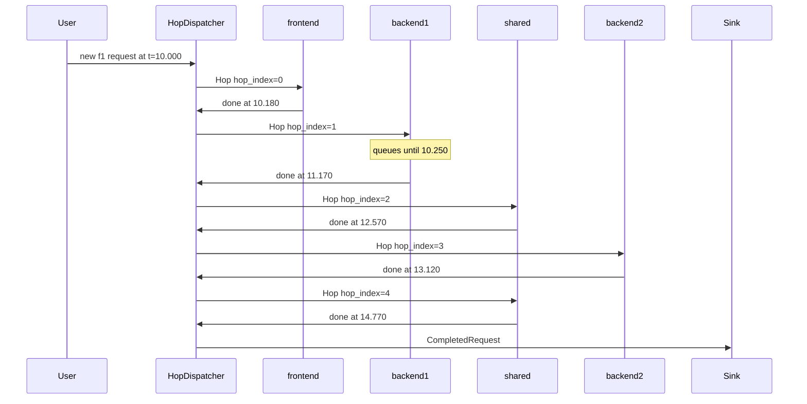

# Microservice Simulation (`ms`)

This document describes how the microservice simulator works: inputs, internal model, request flow, and metrics. The simulator is implemented as a separate binary (`ms`) and module (`src/microservice/`) that does not modify the flat load-balancer simulator (`lb`).

## Overview

The simulator models a microservice application as a directed graph of endpoints. User requests arrive as independent Poisson processes (one per API), traverse a precomputed sequential path through the callgraph, and experience queueing and local processing at each microservice along the way.

```
Poisson sources (per API)
        │
        ▼
  HopDispatcher  ◄──────────────────┐
        │                           │
        ▼                           │
  Service Balancer → Replica(s) ────┘
        │
        ▼ (path complete)
   stats sink
```

## Input files

### `callgraph.json`

Describes the application topology.

**`nodes`** — one entry per actor:

| Node kind | Fields | Notes |
|-----------|--------|-------|
| `USER` | `interfaces` | Synthetic entry point. Not simulated as a service. |
| Service (e.g. `frontend`) | `interfaces`, `cpu`, `replicas` | A deployable microservice. |

Each **interface** (endpoint) on a service has a mean local processing time in **milliseconds**, specified as either:

- `"avg_rt": 0.2` — mean 0.2 ms, or
- `"exponential": { "mean": 0.8 }` — mean 0.8 ms

Both forms define the mean of an **exponential** random variable sampled when that endpoint processes a hop (converted to seconds internally for simulation).

**`cpu`** is the total concurrency of the microservice (shared across all interfaces). **`replicas`** is the number of replica instances. Each replica gets `cpu / replicas` concurrent processing slots.

**`edges`** — directed calls between endpoints:

```json
{ "source": "frontend:f1", "target": "backend1:f2", "api": "f1" }
```

- `source` / `target` — `"<service>:<interface>"` or `"USER"`.
- `api` (optional) — tags which root API this edge belongs to. Omitted on `USER → …` entry edges.

**Entry APIs:** each `USER → <service>:<interface>` edge defines an API named after the interface suffix (e.g. `frontend:f1` → API `"f1"`).

**Edge filtering:** when simulating API `"f1"`, only follow edges whose `api` field equals `"f1"`.

### `load.json`

Maps API name to request rate (requests per second):

```json
{
    "f1": 2000,
    "g1": 500
}
```

Every key must match an entry API from the callgraph. Each API gets an independent Poisson arrival process at the given RPS.

## Path precomputation

At startup, for each entry API, the simulator builds an **ordered list of endpoints** by depth-first traversal with **sequential children** (follow edges in JSON array order; fully complete each subtree before the next sibling):

```
function build_path(api, endpoint):
    path.append(endpoint)
    for child in edges_from(endpoint) filtered by api:
        build_path(api, child)
```

**Example** (fanin fixture, API `"f1"`):

```
frontend:f1 → backend1:f2 → shared:f5 → backend2:f4 → shared:f5
```

**Example** (API `"g1"`):

```
frontend:g1 → backend1:f3
```

The path is stored and never changes at runtime. Downstream calls are **sequential** — only one hop is in flight per request at any time. There is no parallel fan-out or fork-join.

## Simulation entities

| Entity | Count | Role |
|--------|-------|------|
| **Poisson source** | one per API | Generates user requests at RPS from `load.json` |
| **HopDispatcher** | 1 | Orchestrates request flow: creates hops, samples service times, routes to balancers, collects metrics |
| **Balancer** | one per microservice | Routes hops to a replica using the configured LB policy |
| **Replica** | `replicas` per microservice | FCFS queue + concurrent workers; processes local work, returns hop to HopDispatcher |

### What a microservice models

A callgraph service node becomes:

- `replicas` × `Replica` models, each with `max_concurrency = cpu / replicas`
- 1 × `Balancer` fanning out to those replicas

All interfaces of a service (e.g. `backend1:f2` and `backend1:f3`) share the same replica pool. The queue is per-replica, not per-interface.

### What is NOT modeled

- Network latency between services
- Per-endpoint concurrency (only per-service `cpu`)
- Parallel fan-out / fork-join
- Direct replica-to-replica messaging
- Retries, failures, or timeouts

## Request lifecycle

### One user request = one `Hop`

There is no fan-out into separate sub-requests and no request-id lookup table. A single `Hop` struct carries all context across steps:

| Field | Set when | Changes? |
|-------|----------|----------|
| `api` | User arrival | Never |
| `start` | User arrival | Never — used for e2e latency |
| `hop_index` | Each dispatch | Incremented after each replica completes |
| `duration` | Each dispatch | Re-sampled exponential for current endpoint |
| `processing_time` | Each completion | Running sum of all hop durations so far |
| `finish` | Final hop | Set when path is exhausted |

### Continuation model (how downstream calls work)

In a real system, a service finishes local work, calls a downstream service, blocks until the response, then continues.

In the simulator, **replicas never send responses back to a parent replica**. All replica outputs connect to **HopDispatcher**:

1. HopDispatcher sends `Hop` to the **target service's Balancer**.
2. Balancer picks a replica; replica queues or processes locally for `duration`.
3. On completion, replica sends the **same `Hop`** back to HopDispatcher.
4. HopDispatcher accumulates metrics, increments `hop_index`, and either dispatches the next hop or emits a `CompletedRequest`.

The caller's replica (e.g. frontend) is not involved after its own step. The blocking continuation that would live on the parent's call stack in a real RPC is modeled by HopDispatcher not advancing until the current hop finishes.

| Real system | Simulator |
|-------------|-----------|
| Parent calls child, blocks until response | Next hop cannot start until current replica completes |
| Child response resumes parent code | HopDispatcher receives completed `Hop`, advances `hop_index` |
| Response to user after full chain | `CompletedRequest` emitted after final hop |

### HopDispatcher logic

```
on_user_arrival(api, time):
    hop = Hop { api, hop_index: 0, start: time, processing_time: 0 }
    dispatch(hop)

on_replica_complete(hop, finish_time):
    hop.processing_time += hop.duration
    busy_time[service(endpoint)] += hop.duration
    hop.hop_index += 1
    if hop.hop_index == paths[hop.api].len():
        emit CompletedRequest { api, start: hop.start, finish: finish_time, processing_time }
    else:
        dispatch(hop)

dispatch(hop):
    endpoint = paths[hop.api][hop.hop_index]
    hop.duration = sample_exponential(means[endpoint])
    send hop to balancers[service(endpoint)]
```

## Model wiring

```
For each API in load.json:
    Poisson source ──▶ HopDispatcher.new_request

For each microservice with balancer LB and replicas R0..Rk:
    HopDispatcher ──▶ LB.input
    LB.outputs[i] ──▶ Ri.input
    Ri.output ──▶ HopDispatcher.replica_complete    (all replicas, all services)

HopDispatcher.completed ──▶ stats sink
```

Each Balancer reads load counters (`in_flight + queue.len()`) from its replicas, same as the flat `lb` simulator.

## Request flow example

**Fixture:** `tests/fanin/callgraph.json`, API `"f1"`, arrival at **t = 10.000s**.

**Path:**

| Step | Endpoint | Mean (callgraph) |
|------|----------|------------------|
| 0 | frontend:f1 | 0.2 ms |
| 1 | backend1:f2 | 0.8 ms |
| 2 | shared:f5 | 1.5 ms |
| 3 | backend2:f4 | 0.5 ms |
| 4 | shared:f5 | 1.5 ms |

**Timeline** (simulation times in seconds; one `Hop` advancing through steps):

| Step | Endpoint | Sampled duration | Service start | Service end | `processing_time` after |
|------|----------|------------------|---------------|-------------|-------------------------|
| 0 | frontend:f1 | 0.00018s | 10.000 | 10.00018 | 0.00018 |
| 1 | backend1:f2 | 0.00092s | 10.00025 (queued) | 10.00117 | 0.00110 |
| 2 | shared:f5 | 0.00140s | 10.00117 | 10.00257 | 0.00250 |
| 3 | backend2:f4 | 0.00055s | 10.00257 | 10.00312 | 0.00305 |
| 4 | shared:f5 | 0.00165s | 10.00312 | 10.00477 | 0.00470 |

After step 4, HopDispatcher emits:

```
CompletedRequest { api: "f1", start: 10.000, finish: 10.00477, processing_time: 0.00470 }
```

**Metrics for this request:**

- **e2e latency** = 10.00477 − 10.000 = **0.00477s** (includes queue wait at backend1)
- **processing time** = sum of hop durations = **0.00470s** (local work only)



## Metrics

All latency values in **output** are in **milliseconds**, grouped **per API** under `by_api`.

### Per request (per API)

| Metric | Definition |
|--------|------------|
| **e2e_ms** | `finish − start` in ms — wall-clock from user arrival to final hop completion (includes all queueing) |
| **processing_time_ms** | Sum of sampled local durations across all hops in ms (excludes queueing) |

Queueing delay per request = `e2e_ms − processing_time_ms` (derivable, not a primary output).

### SLO (per API, same rule as `lb`)

| Metric | Definition |
|--------|------------|
| **unloaded_latency_p99_ms** | p99 of that API's `processing_time_ms` samples |
| **slo_latency_ms** | `5 × unloaded_latency_p99_ms` |

### Per microservice

| Metric | Definition |
|--------|------------|
| **Utilization** | `busy_time[s] / (observation_time × cpu[s]) × 100` |

`busy_time[s]` is the sum of all sampled hop durations executed on any replica of service `s`. Each hop is attributed to the microservice that owns the endpoint (e.g. `backend1:f2` → `backend1`). Visiting the same service twice in one request (e.g. `shared:f5` twice) contributes twice to that service's busy time.

## CLI and output

```bash
cargo build --release
./target/release/ms \
  --callgraph tests/fanin/callgraph.json \
  --load-file tests/fanin/load.json \
  --format json \
  --n 100000
```

| Flag | Description |
|------|-------------|
| `--callgraph` | Path to callgraph JSON (required) |
| `--load-file` | Path to per-API RPS JSON (required) |
| `--n` | Total requests, split across APIs proportional to RPS |
| `--lb-policy` | `random`, `power-of-two`, `least-request`, or `round-robin` |
| `--lb-subset-size` | Replica subset per balancer (`0` = all) |
| `--format` | `human` or `json` |

**JSON output:**

```json
{
  "utilization_pct": {
    "frontend": 2.02,
    "backend1": 9.41,
    "backend2": 2.54,
    "shared": 7.46
  },
  "by_api": {
    "f1": {
      "e2e_ms": [4.2, 5.1],
      "processing_time_ms": [3.0, 4.1],
      "unloaded_latency_p99_ms": 11.6,
      "slo_latency_ms": 58.0
    },
    "g1": {
      "e2e_ms": [1.2, 1.5],
      "processing_time_ms": [0.9, 1.1],
      "unloaded_latency_p99_ms": 9.8,
      "slo_latency_ms": 49.0
    }
  }
}
```
