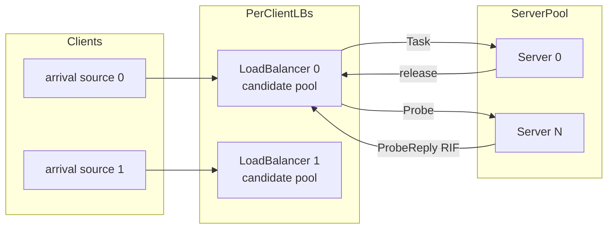
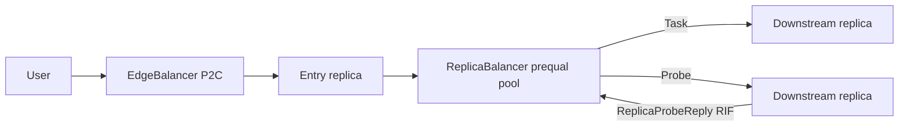

# Prequal policy (async probe pool)

This document describes the **prequal** load-balancing policy: a simplified async probe-pool push policy for the `lb` and `ms` simulators. It is inspired by [Prequal (NSDI’24)](https://www.usenix.org/conference/nsdi24/presentation/wydrowski) but implements only the RIF-based async pool path described below.

See also:

- [lb-simulation.md](lb-simulation.md) — general `lb` simulator
- [microservice-simulation.md](microservice-simulation.md) — general `ms` simulator
- [lb-vs-ms.md](lb-vs-ms.md) — feature comparison

## Overview

**Prequal** is a **decentralized push** policy. Unlike other push policies that select using only **local** inflight counts, each load balancer asynchronously maintains a **candidate pool** of probed server RIF values and routes to the best candidate in that pool.

| Aspect | Typical push (`power-of-two`, `least-request`, …) | Prequal |
|--------|---------------------------------------------------|--------|
| Dispatch trigger | Arrival | Arrival |
| Load signal | `local_inflight` (this LB’s outstanding sends) | Probed server RIF (`queue.len + in_flight`) |
| Probing | None | Fractional `r_probe` probes per request (async, off critical path) |
| Candidate memory | Subset / samples only | Reusable probe pool |
| `--lb-subset-size` | Supported | **Rejected** if `> 0` |
| `ms` simulator | Supported (shared policies) | Outbound `ReplicaBalancer` only (ingress stays P2C) |

Probe RPCs use zero-delay nexosim messages (same delivery model as `release`). The current request never waits for probe replies; it uses the pool built from prior probes.

## Parameters (hardcoded)

| Parameter | Value | Meaning |
|-----------|-------|---------|
| `r_probe` | `1.5` | Fractional probes issued per request |
| `b_reuse` | `1` | Max selections of a candidate before removal |
| `r_remove` | `0.3` | Fractional worst-candidate removals per request |
| `pool_cap` | `ceil(0.25 × N)` | Max candidates (`N` = server count visible to the LB) |

## Pseudocode

```text
constants: R_PROBE=1.5, B_REUSE=1, R_REMOVE=0.3, POOL_CAP=ceil(0.25*N)

on_request(task):
  remove_accum += R_REMOVE
  while remove_accum >= 1 and pool nonempty:
    remove highest-RIF candidate (tie: oldest)
    remove_accum -= 1

  if pool nonempty:
    s = argmin RIF in pool (tie: oldest)
  else:
    s = uniform random server in [0, N)

  send task to s
  local_inflight[s] += 1

  if s in pool:
    entry.rif += 1
    entry.uses += 1
    if entry.uses >= B_REUSE: remove entry

  probe_accum += R_PROBE
  n_probes = 0
  while probe_accum >= 1:
    n_probes += 1
    probe_accum -= 1
  targets = sample n_probes servers from {0..N-1} \ pool  # without replacement
  for t in targets: send Probe(lb_id) to t

on_probe_reply(server, rif):
  if server in pool:
    refresh rif; uses = 0; mark newest
  else:
    if |pool| >= POOL_CAP: evict oldest
    insert (server, rif, uses=0) as newest

on_probe_at_server(lb_id):
  reply ProbeReply(server_idx, queue.len + in_flight)
```

## Wire protocol

Shared types live in [`src/prequal.rs`](../src/prequal.rs):

```rust
Probe { sender_id }                 // LB → server / replica
ProbeReply { server_idx, rif }      // server → LB (lb simulator)
```

In `ms`, replicas reply with `ReplicaProbeReply { microservice_id, server_idx, rif }` so the caller `ReplicaBalancer` can update the correct per-target pool.

Server/replica RIF is `queue.len() + in_flight`. Probes themselves do not count toward RIF.

## Architecture (`lb`)



Each client LB owns an independent candidate pool. Servers reply to the probing LB identified by `Probe.sender_id`.

## Architecture (`ms`)

In `ms`, prequal is **outbound-only** and decentralized (no shared `DownstreamBalancer`):

- **EdgeBalancer** (user ingress): always **power-of-two**
- **ReplicaBalancer** (per caller replica): one candidate pool **per downstream target microservice**; probes sibling replicas of that target



## Per-request lifecycle

1. **`r_remove`** — accumulate `0.3`; while debt `≥ 1`, drop highest-RIF candidate (oldest on ties).
2. **Select** — least RIF in pool, else uniform random among all servers.
3. **Dispatch** — send task; update `local_inflight` (release accounting unchanged).
4. **Optimistic pool update** — if the chosen server is in the pool, `rif += 1` and `uses += 1`; remove at `b_reuse`.
5. **Probe** — accumulate `r_probe`; while debt `≥ 1`, count one probe; sample that many servers not currently in the pool; send probes.
6. **Probe replies** (async) — insert or refresh pool entries; at capacity, evict oldest before insert.

## Incompatibilities

- `--lb-subset-size > 0` — rejected (both `lb` and `ms`)
- `--pull-policy` / `--approx-sched` — rejected (approx-only flags)

Express lane and work shedding remain allowed on the `lb` push path, same as other push policies.

## CLI

```bash
./target/release/lb --lb-policy prequal --servers 100 --clients 10 --n 100000

./target/release/ms \
  --lb-policy prequal \
  --callgraph tests/chain/3/callgraph.json \
  --load-file tests/chain/3/load.json \
  --n 100000
```

## Source map

| File | Role |
|------|------|
| [`src/prequal.rs`](../src/prequal.rs) | Wire types, constants, `CandidatePool` |
| [`src/policy.rs`](../src/policy.rs) | `LoadBalancePolicyKind::Prequal`, validation |
| [`src/load_balancer.rs`](../src/load_balancer.rs) | `lb` request path, probe replies |
| [`src/server.rs`](../src/server.rs) | `lb` probe handler / RIF reply |
| [`src/lb_simulate.rs`](../src/lb_simulate.rs) | `lb` probe port wiring |
| [`src/microservice/balancer.rs`](../src/microservice/balancer.rs) | `ms` outbound prequal dispatch / probe replies |
| [`src/microservice/replica.rs`](../src/microservice/replica.rs) | `ms` probe handler / RIF reply |
| [`src/microservice/simulate.rs`](../src/microservice/simulate.rs) | `ms` probe port wiring |

## Tests

```bash
cargo test --test lb_prequal
cargo test --test ms_prequal
cargo test --lib prequal
```

## Future work (not implemented)

Full Prequal features intentionally omitted for this simulator version; document for later:

- **Latency signal / HCL selection** — hot-cold lexicographic rule combining RIF quantile and estimated latency
- **Probe TTL / age timeout** — drop candidates when age exceeds a threshold
- **Alternating `r_remove`** — alternate removing oldest vs worst (this version always removes highest RIF)
- **Idle background probing** — probe after max idle time when no requests arrive
- **CLI-tunable parameters** — `r_probe`, `b_reuse`, `r_remove`, pool fraction (currently hardcoded)
