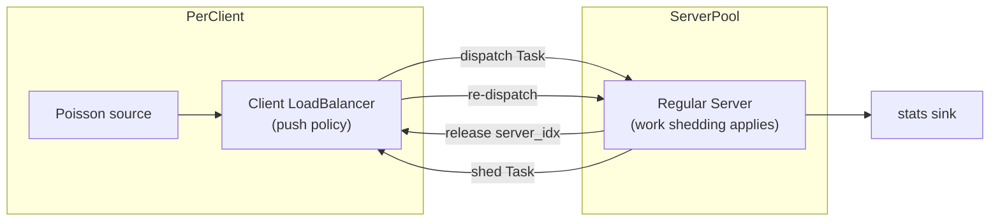

# Work Shedding

Work shedding lets overloaded regular servers return queued tasks to the originating client load balancer for re-routing. The load balancer then picks another server using its normal push policy.

**lb only** — not available in the microservice simulator (`ms`). See [lb-vs-ms.md](lb-vs-ms.md).

Enable with `--shed-delay <seconds>`. When the flag is omitted, servers do not shed work.

## Topology



## Parameters

| Flag | Role |
|------|------|
| `--shed-delay` | Queueing delay threshold in seconds; when exceeded, the server sheds the newest queued task back to the originating client LB |

`--shed-delay` must be positive and finite.

## Compatibility

| Combination | Supported? |
|-------------|------------|
| Push policies (`random`, `power-of-two`, `least-request`, `round-robin`) | Yes |
| `--lb-policy centralized` | No — servers do not queue locally |
| `--lb-policy approx` | No — servers do not queue locally |
| `--expresslane` or express flags | No — mutually exclusive at startup |

## Shedding policy (regular servers only)

When a regular server is at capacity (`in_flight == concurrency`), incoming tasks are queued. After enqueue, shedding is evaluated if `--shed-delay` is set.

Two triggers (same semantics as express-lane **monitored delay** mode; see [expresslane.md](expresslane.md#delay-mode---express-del-th-only)):

| Trigger | Condition | Action |
|---------|-----------|--------|
| **Head-of-line wait** | `max(now - service_started_at) > shed_delay` over in-flight tasks | Shed the **newest** queued task immediately |
| **Monitored queue wait** | `ideal_delay > shed_delay` for the new task | Schedule a keyed timer at `shed_delay`; if still queued when it fires, shed that task |

Head-of-line wait measures how long the longest-running in-flight request has been processing since service started. Immediate shedding always pops the **newest** task (back of the FIFO queue).

Projected delay for a newly queued task:

```
ideal_delay = sum(task.duration for task in queue)
            + min(task.duration - (now - service_started_at) for each in-flight task)
```

When a task is enqueued:

1. If head-of-line wait exceeds the threshold, pop the **newest** task and return it to the originating client LB immediately.
2. Otherwise, if `ideal_delay > shed_delay`, schedule a keyed shed event at `shed_delay` seconds later.
3. If the task starts service before the timer fires, cancel the pending shed.
4. When the timer fires, if the task is still queued, remove it and return it to the originating client LB.

## Release lifecycle (immediate release on shed)

Unlike express lane, work shedding **does** send a release to the client LB when a task is shed:

1. `release_outputs[lb_id]` → `LoadBalancer::release` (decrement `local_inflight` on the shedding server)
2. `shed_outputs[lb_id]` → `LoadBalancer::input` (LB re-runs normal push routing)

On re-dispatch, the load balancer increments `local_inflight` on the newly selected server and may update `origin_server_idx`.

Shed tasks may land on a different server. There is no retry cap — under persistent overload, tasks may re-route multiple times before completing.

## Metrics

When `--shed-delay` is set, the simulator reports the percentage of completed requests that were shed at least once:

| Format | Field | Description |
|--------|-------|-------------|
| Human | `shed requests: X.XX%` | Percentage of completed requests with `shed_at` set |
| JSON | `pct_shed_requests` | Same value (omitted when work shedding is disabled) |

The denominator is the total number of completed requests. A request shed multiple times counts once.

## Task fields

| Field | Set when | Purpose |
|-------|----------|---------|
| `shed_at` | `Server::forward_shed` | Timestamp when the task was shed (optional diagnostic) |
| `lb_id` | LoadBalancer before dispatch | Routes shed task and release back to the correct LB |
| `origin_server_idx` | LoadBalancer before dispatch | Server index at last dispatch (updated on re-route) |

## Wiring

For each regular server `j` and client LB `i` (when `--shed-delay` is set):

```
Server_j.shed_outputs[i] ──▶ LoadBalancer_i.input
Server_j.release_outputs[i] ──▶ LoadBalancer_i.release  (also used on completion)
```

Shed outputs connect to the **client** load balancers, not a dedicated overflow pool.

## See also

- [lb-simulation.md](lb-simulation.md) — server queue model and task lifecycle
- [expresslane.md](expresslane.md) — alternative overflow path to a dedicated express pool
